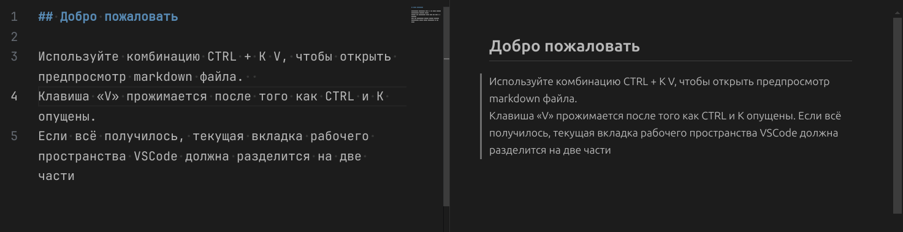

 *Вы можете свободно редактировать этот файл*  
Расчётное время на выполнение всех задач: от 10 до 40 минут.

## Добро пожаловать  

Используйте комбинацию CTRL + K V, чтобы открыть предпросмотр markdown файла.  
Клавиша «V» прожимается после того как CTRL и K опущены.
Если всё получилось, текущая вкладка рабочего пространства VSCode должна разделится на две части

  

<!-- замените символ пробел на символ x английской расскладки между квадратных скобок -->
- [ ] CTRL + K V — привело к открытию документа в режиме просмотра
  
Когда задача выполнена, вы вольны отметить её как выполненную. Вот как это можно сделать:
- В некоторых программах вы можете кликнуть мышью по задаче чтобы изменить её статус
- Для этой рабочей области (в рамках рабочего каталога файлов) рекомендовано расширение «Markdown all in one». Оно позволяет переключать статус задачи комбинацией ALT + C внутри исходного файла, когда курсор мыши на той же линии, что и задача
- Фактически статус задачи зависит от исходного файла. Существует два основных состояния пусто ([ ]) и заполнено ([x])

Задача: изменить статус предыдущей задачи, чтобы это отразилось на втором редакторе. Для этого в исходном markdown файле между квадратных скобок должен оказаться английский «икс» (x)


Что если режим просмотра не открылся?  
Найдите панель сверху и соответсвующую кнопку «Open preview to the Side» или проведите дополнительную работу и найдите руководство в интернете: VSCode open markdown file preview

Статус задачи не изменился?.
Попробуйте скопировать и вставить следующее в исходный markdown файл:
```
- [ ] Не выполнено
- [x] Выполнено
```
— и сравните как это отразится в режиме просмотра.
